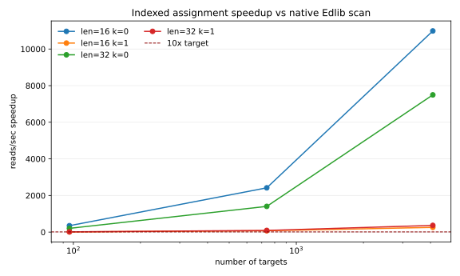
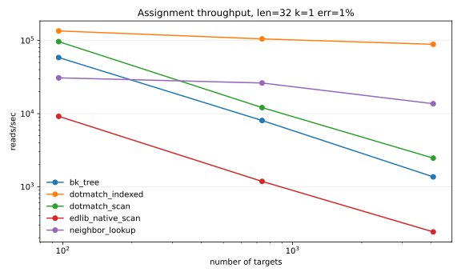

# DotMatch

[](https://github.com/Dnncha/dotmatch/actions/workflows/ci.yml)
[](LICENSE)
[](CITATION.cff)

Fast exact matching for short DNA reads.

DotMatch does one job: assign short reads to a known set of short DNA targets.

It is useful for barcodes, primers, adapters, UMIs, guide sequences, panels, and similar target lists where every read should end up as one of:

- `unique`
- `ambiguous`
- `none`
- `invalid`

It is not a genome aligner. There is no SAM/BAM output, no CIGAR, and no reference mapping layer. The repository contains a small C core, a CLI, Python ctypes bindings, tests, and benchmark scripts.

DotMatch is Apache-2.0 open source.

## What Is Checked

- The C tests compare the optimized paths with a dynamic-programming oracle.
- FASTQ assignment has deterministic outcomes; ties are reported, not hidden.
- CRISPR examples have committed benchmark rows and validation gates.
- Barcode and raw-BCL examples are included, but are treated as workflow demos unless their real-data checks pass.
- Output schemas and evidence boundaries are documented in [Evidence Notes](docs/scientific-claims.md).

## Included In `v0.1.0`

- exact global edit distance
- Myers 64-bit bit-vector kernel when one sequence is `<=64 bp`
- thresholded `distance <= k` queries with early rejection
- batch many-read vs many-target assignment
- unique/ambiguous/no-match result semantics
- CLI for pairwise and file-based batch workflows
- Python `dotmatch` console workflow for FASTQ/FASTQ.gz count tables
- target-set auditing for one-edit ambiguity risk
- indexed-vs-exhaustive native validation mode
- native FASTQ/FASTQ.gz `count` with `--metric hamming|levenshtein`
- optional one-base Levenshtein indel windows and guide-offset detection for CRISPR-style reads
- Python `dotmatch` module via ctypes
- Python source/wheel builds that bundle the native core on Linux and macOS
- deterministic fuzz tests against the DP oracle
- microbenchmarks and synthetic barcode batch benchmarks
- optional Python Edlib comparison

Not included:

- semi-global/infix alignment
- traceback/CIGAR
- wildcard `N` semantics
- native SeqAn/Parasail benchmark harnesses
- SIMD/NEON-specific implementation
- PyPI/Bioconda packages

## Quickstart

```bash
git clone https://github.com/Dnncha/dotmatch.git
cd dotmatch
make

./dotmatch dist ACGT AGGT
./dotmatch leq 1 ACGT AGGT
make cli-test
```

Python source install:

```bash
python3 -m pip install .
python3 -c "import dotmatch; print(dotmatch.distance('ACGT', 'AGGT'))"
```

Repository verifier:

```bash
python3 -m pip install build
make python-package-test
make repository-ready
```

## Build

```bash
make
make shared
make test
make coverage
make asan
```

`make coverage` runs the native C tests and CLI fixture suite against an instrumented build, writes text/JSON/HTML reports under `build/coverage/`, and currently enforces at least 75% line coverage across `src/qdalign.c` and `src/qda.c`.

## CLI

Pairwise:

```bash
./dotmatch dist ACGT AGGT
# 1

./dotmatch leq 1 ACGT AGGT
# true
```

Batch assignment:

```bash
cat > barcodes.tsv <<'EOF'
bc0	ACGT
bc1	AGGT
bc2	ACGA
EOF

cat > reads.tsv <<'EOF'
r0	ACGT
r1	ACGC
r2	TTTT
EOF

./dotmatch assign 1 barcodes.tsv reads.tsv
```

Input files accept either one sequence per line or `id<TAB>sequence`.

FASTQ barcode assignment:

```bash
./dotmatch fastq-assign \
  --barcodes barcodes.tsv \
  --reads reads.fastq.gz \
  --barcode-start 0 \
  --barcode-length 16 \
  --k 1 \
  --out assignments.tsv
```

`fastq-assign` streams the FASTQ input, supports `.gz` reads via zlib, uses the reusable target index for `k=0` and `k=1`, and writes deterministic `unique`/`ambiguous`/`none`/`invalid` assignment rows.

FASTQ barcode demultiplexing:

```bash
./dotmatch demux \
  --barcodes barcodes.tsv \
  --reads pooled.fastq.gz \
  --barcode-start 0 \
  --barcode-length 8 \
  --k 1 \
  --metric hamming \
  --out-dir demuxed \
  --summary demux.qc.json \
  --assignments demux.assignments.tsv \
  --ambiguous-out ambiguous.fastq \
  --unmatched-out unmatched.fastq
```

`demux` writes one FASTQ per uniquely assigned barcode under `--out-dir`. Ambiguous reads are never assigned silently; use `--ambiguous-out` and `--unmatched-out` to inspect rejected reads. This demux surface targets fixed-position inline barcodes in single-end FASTQ/FASTQ.gz. Use `--barcode-length auto` when the barcode sheet contains multiple barcode lengths; prefix-overlapping exact matches are reported as ambiguous rather than silently assigned to the longest prefix.

Classic Illumina BCL demultiplexing:

```bash
./dotmatch bcl-demux \
  --run-folder 240101_TEST_RUN \
  --sample-sheet SampleSheet.csv \
  --out-dir bcl_demuxed \
  --barcode-mismatches 1 \
  --summary bcl.summary.json

./dotmatch bcl-validate \
  --dotmatch-out bcl_demuxed \
  --truth-out bclconvert_output
```

`bcl-demux` currently supports the first classic per-cycle BCL milestone: `RunInfo.xml`, sample-sheet v1/v2 data sections, `Data/Intensities/BaseCalls/L00*/C*.1/s_*_*.bcl(.gz)`, and `.filter` files. It writes sample FASTQ.gz, `Undetermined` FASTQ.gz, `Demultiplex_Stats.csv`, `SampleSheet.normalized.csv`, and summary JSON. CBCL/NovaSeq-style input is outside the current scope.

Native count-table workflow:

```bash
./dotmatch count \
  --targets guides.csv \
  --reads sample_R1.fastq.gz \
  --target-start 0 \
  --target-length 20 \
  --k 1 \
  --metric levenshtein \
  --ambiguity-policy best \
  --indel-window 1 \
  --out counts.tsv \
  --target-counts-long target_counts.long.tsv \
  --sample-qc sample_qc.tsv \
  --assignments assignments.tsv \
  --summary summary.json \
  --report report.html \
  --report-audit-dir audit/ \
  --report-unmatched top_unmatched.tsv
```

Targets may be tab-separated `target_id<TAB>target_seq<TAB>gene` or MAGeCK-style CSV with headers such as `id,gRNA.sequence,Gene`. The count table reports exact reads, one-substitution corrections, one-insertion corrections, one-deletion corrections, other corrections, total assigned reads, and whether the target has a nearby target that can create `k`-edit ambiguity. `--target-counts-long` writes one row per sample/target with the same provenance fields, and `--sample-qc` writes assignment rate, exact/rescued/ambiguous/no-match rates, target coverage, zero-count targets, Gini index, top-1% dominance, and candidate-verification totals.

`--report report.html` writes a native HTML run summary with assignment rates, exact/rescued/ambiguous/no-match breakdowns, library coverage, candidate-verification totals, and warnings for high ambiguous or no-match rates. If `--report-audit-dir` or `--report-unmatched` are supplied, the report also embeds a library-audit summary and top-unmatched preview. It is intentionally deterministic and self-contained so it can be archived with the count matrix.

Use `--metric hamming` for a guide-counter-style one-mismatch/no-indel comparison. Use `--metric levenshtein --indel-window 1` when the workflow should recover one-base insertions/deletions around the extracted target window. `--auto-offset N` samples each FASTQ and chooses the best target start within `N` bases of `--target-start` using exact matches.

Assignment ambiguity is explicit. `--ambiguity-policy best` assigns a read when exactly one target has the best distance within `k`; `--ambiguity-policy radius` assigns only when exactly one target is within the whole radius. Ambiguous reads are discarded from counts by default. Use `--ambiguous report` to include ambiguous rows in `assignments.tsv` for diagnostics; they are still not silently counted for a target.

MAGeCK-compatible count table:

```bash
./dotmatch count \
  --targets yusa_library.csv \
  --reads ERR376998.fastq.gz \
  --reads ERR376999.fastq.gz \
  --sample-label plasmid,ESC1 \
  --target-start 23 \
  --target-length 19 \
  --k 1 \
  --metric levenshtein \
  --indel-window 1 \
  --format mageck \
  --out counts.mageck.tsv
```

CRISPR-focused multi-sample count matrix:

```bash
cat > samples.tsv <<'EOF'
sample_id	fastq
control_1	control_1.fastq.gz
control_2	control_2.fastq.gz
drug_1	drug_1.fastq.gz
drug_2	drug_2.fastq.gz
EOF

./dotmatch crispr-count \
  --library guides.csv \
  --samples samples.tsv \
  --guide-start 0 \
  --guide-length 20 \
  --k 1 \
  --metric levenshtein \
  --indel-window 1 \
  --out counts.mageck.tsv \
  --summary qc.json \
  --ambiguous discard
```

`crispr-count` is the CRISPR-facing wrapper around the native count engine. It defaults to MAGeCK-compatible count-matrix output and accepts the same deterministic ambiguity policy as `count`. The QC JSON reports exact assigned reads, one-edit rescued reads, ambiguous reads, unmatched reads, and candidate-verification totals per sample.

Target library audit:

```bash
./dotmatch audit \
  --targets guides.tsv \
  --k 1 \
  --audit-mode auto \
  --out-dir audit/
```

Native audit writes `audit_summary.tsv`, `audit_summary.json`, `collision_pairs.tsv`, `collision_clusters.tsv`, and `target_safety.tsv`. It reports duplicates, minimum edit distance, pairs at distances 0/1/2, whether the library is safe for `k=0`, `k=1`, and `k=2` correction, and per-target nearest-neighbor risk under the same edit-distance semantics used by assignment. `--audit-mode exact` uses exhaustive pairwise distances. `--audit-mode fast` uses one-edit variant indexing for large-library `k=1` safety and reports `not_computed`/`null` for `k=2`-only fields.

For `k=1`, audit also writes `ambiguous_variants.tsv` and records `ambiguous_query_variants_k1` in the summary. This enumerates exact one-edit query variants that would fall within distance 1 of multiple targets, which is the practical safety question behind one-edit rescue.

Top unmatched diagnosis:

```bash
./dotmatch inspect-unmatched \
  --targets guides.tsv \
  --reads sample_R1.fastq.gz \
  --target-start 0 \
  --target-length 20 \
  --k 1 \
  --offset-window 2 \
  --adapter ACGTTT \
  --low-quality-threshold 20 \
  --top 100 \
  --out top_unmatched.tsv
```

This reports the most frequent unassigned extracted sequences, nearest known target, nearest edit distance, edit class, reverse-complement nearest-target hint, optional offset-shift hint, adapter/primer hint when `--adapter` is supplied, low-quality hint when `--low-quality-threshold` is supplied, and a coarse reason such as `near_known_target_above_k`, `reverse_complement_candidate`, `offset_shift_candidate`, `adapter_or_primer_candidate`, `low_quality_candidate`, `contains_N`, or `wrong_length`.

Validation against the native exhaustive scan path:

```bash
DOTMATCH_LIB=$PWD/libdotmatch.dylib PYTHONPATH=$PWD/python python3 -m dotmatch.cli validate \
  --targets guides.tsv \
  --reads sample_R1.fastq.gz \
  --target-start 0 \
  --target-length 20 \
  --k 1 \
  --sample 100000
```

This validates DotMatch's indexed assignment against DotMatch's exact native scan oracle.

Optional native Edlib validator:

```bash
make edlib-tools
./dotmatch validate \
  --targets guides.tsv \
  --reads sample_R1.fastq.gz \
  --target-start 0 \
  --target-length 20 \
  --k 1 \
  --indel-window 1 \
  --oracle edlib \
  --sample 100000
```

## Python

```bash
make shared
DOTMATCH_LIB=$PWD/libdotmatch.dylib PYTHONPATH=$PWD/python python3
```

```python
import dotmatch

dotmatch.distance("ACGT", "AGGT")
# 1

dotmatch.distance_leq("ACGT", "AGGT", 1)
# True

dotmatch.assign(["ACGT", "ACGC"], ["ACGT", "AGGT", "ACGA"], k=1)
```

Reusable indexed assignment:

```python
matcher = dotmatch.Matcher(["ACGT", "AGGT", "ACGA"])
results, stats = matcher.assign_with_stats(["ACGT", "ACGC"], k=1)
stats.candidates_verified
```

The old `quickdna` Python package and `qda` CLI target are kept as transition aliases while the project moves to the DotMatch name.

## Benchmarks

Benchmark data policy: commit reproducible benchmark evidence, not large
working datasets. Keep curated CSVs under `benchmarks/raw/`, figures under
`benchmarks/figures/`, and reports under `docs/benchmarks/`. Generated run
folders, demultiplexed FASTQs, downloaded public datasets, and comparator
scratch output belong in ignored local paths such as `benchmarks/work/` and
`examples/*/data/`; recreate them with the fetch and benchmark scripts below.

Pairwise and threshold microbenchmark:

```bash
make bench
```

Synthetic barcode batch benchmark:

```bash
make bench-batch
# or a smaller smoke run:
./build/bench_batch 1000
```

Barcode demultiplexing benchmark/report:

```bash
make bench-barcode-demux

# For a real public or in-house inline-barcode dataset:
python3 scripts/bench_barcode_demux.py \
  --reads SRR391079.fastq.gz \
  --barcodes barcodes.tsv \
  --barcode-start 1 \
  --barcode-length auto \
  --k 0 \
  --run-cutadapt \
  --run-hash-splitter
python3 scripts/generate_barcode_demux_report.py
```

The default `make bench-barcode-demux` fixture is for smoke testing the graph/report pipeline and includes a simple exact prefix hash-splitter baseline. Use real barcode FASTQ inputs and pinned comparator versions before treating the report as benchmark evidence.

Real-data inline barcode comparisons can be run separately:

```bash
python3 scripts/fetch_srp009896_barcode_demo.py \
  --metadata-only \
  --use-public-example-barcodes \
  --require-barcodes

# Or provide an already curated fixed-length barcode sheet:
export DOTMATCH_BARCODE_COMPARISON_BARCODES=/path/to/real_fixed_length_barcodes.tsv
# or: export DOTMATCH_BARCODE_COMPARISON_BARCODES_URL=https://...
# or for the public SRP009896 example barcode sheet:
export DOTMATCH_BARCODE_COMPARISON_USE_PUBLIC_EXAMPLE=1
export DOTMATCH_BARCODE_START=1
export DOTMATCH_BARCODE_K=0
make bench-barcode-comparison
make barcode-comparison-gate
```

`make barcode-comparison-gate` fails when required real-data rows or comparator rows are missing. The public SRP009896 example barcode sheet is variable-length (`4-8 bp`) and contains separate run blocks with reused barcode sequences. SRP009896 reads include a leading `N`, so use `DOTMATCH_BARCODE_START=1` with the public example sheet, and use the `k=0` exact-prefix lane with `--barcode-length auto` unless you provide a separate fixed-length sheet.

Raw BCL demultiplexing benchmark/report:

```bash
make bench-bcl-small
make fetch-10x-bcl-demo
make bcl-competitor-env
make bcl-linux-env
DOTMATCH_BCL_THREADS=8 make bench-bcl-10x

DOTMATCH_BCL_RUN_FOLDER=/path/to/run \
DOTMATCH_BCL_SAMPLE_SHEET=/path/to/SampleSheet.csv \
make bench-bcl-real
DOTMATCH_BCL_REPEATS=5 make bench-bcl-real-repeated

make bcl-comparison-gate
```

`bench-bcl-small` uses a generated classic-BCL run folder and is only a smoke benchmark. Use real run folders, comparator rows where available, repeated timing, and `bcl-validate` output before treating BCL rows as benchmark evidence.

For the public 10x tiny-BCL demo row:

```bash
make fetch-10x-bcl-demo
python3 scripts/bench_bcl_demux.py \
  --run-folder examples/bcl_demux/data/cellranger-tiny-bcl-1.2.0 \
  --sample-sheet examples/bcl_demux/data/cellranger-tiny-bcl-samplesheet.normalized.csv \
  --workflow-name public_10x_tiny_bcl \
  --detect-competitors \
  --run-installed-competitors
python3 scripts/generate_bcl_demux_report.py
```

Native Edlib assignment comparison:

```bash
make benchmark-report-native
make bench-small
make bench-native-matrix
make figures
```

`make figures` records repeated-run native benchmark CSVs under `benchmarks/raw/` and SVG/PDF figures under `benchmarks/figures/`. Use `DOTMATCH_NATIVE_REPEATS=N` and `DOTMATCH_NATIVE_REPORT_READS=N` to control runtime. `make bench-native-matrix` enables the larger native comparison matrix, including `12/16/20/24/32 bp`, `96/737/4096/16384/65536` targets, substitution/indel/no-match/ambiguous modes, peak RSS, and mismatch counts.

External competitor scaffold:

```bash
make competitor-env
python3 scripts/bench_competitors.py \
  --barcodes barcodes.tsv \
  --reads reads.fastq.gz \
  --barcode-start 0 \
  --barcode-length 16 \
  --k 1 \
  --dotmatch ./dotmatch \
  --run-cutadapt \
  --run-bowtie2 \
  --run-guide-counter \
  --out docs/benchmarks/external_competitors.csv
```

Cutadapt, Bowtie2, and guide-counter comparisons are opt-in and run only when those tools are installed and pinned. They are workflow comparators, not exact assignment oracles; native Edlib scan remains the oracle for assignment correctness. For guide-counter-style runs, use `--metric hamming` so the comparison stays in the one-mismatch/no-indel lane.

Reports and raw rows:

- [Evidence notes](docs/scientific-claims.md)
- [Methods and citation template](docs/methods-and-citation.md)
- [Changelog](CHANGELOG.md)
- [Release process](docs/release-process.md)
- [Native Edlib benchmark report](docs/benchmarks/native/README.md)
- [Raw native Edlib assignment CSV](docs/benchmarks/native/native_edlib_assignment.csv)
- [Real CRISPR benchmark report](docs/benchmarks/real/README.md)
- [Public CRISPR workflow comparator](docs/benchmarks/public_crispr/README.md)
- [Raw real CRISPR Edlib CSV](benchmarks/raw/real_crispr_edlib.csv)
- [Raw public CRISPR workflow CSV](benchmarks/raw/public_crispr_workflow.csv)
- [Raw repeated public CRISPR CSV](benchmarks/raw/public_crispr_repeated.csv)
- [Raw public CRISPR count agreement CSV](benchmarks/raw/count_agreement_summary.csv)
- [Raw public CRISPR Edlib validation CSV](benchmarks/raw/public_crispr_edlib_validation.csv)
- [Usability comparison](docs/usability-comparison.md)
- [Contributing guide](CONTRIBUTING.md)
- [Support policy](SUPPORT.md)






Real public CRISPR guide-counting benchmark:

```bash
DOTMATCH_REAL_READS=25 DOTMATCH_REAL_FETCH_RECORDS=25 make bench-real-report
```

This uses the public MAGeCK/Yusa guide library and real FASTQ reads from `ERR376998`/`ERR376999`, compares DotMatch indexed `k=1` assignment to native Edlib exhaustive scan, and writes [the real-data report](docs/benchmarks/real/README.md).

Python Edlib smoke comparison, useful for Python users but not for primary benchmark evidence:

```bash
make shared
python3 -m pip install edlib matplotlib pandas numpy
python3 scripts/bench_vs_edlib.py
```

Appendix report:

- [Python binding benchmark report](docs/benchmarks/README.md)
- [Raw Edlib comparison CSV](docs/benchmarks/edlib_python.csv)
- [Raw batch assignment CSV](docs/benchmarks/batch_assignment.csv)

Benchmark output is plain CSV. When sharing numbers, record the hardware, compiler, OS, command, and git commit. Use native C/C++ comparators for primary graphs; Python binding overhead belongs in the appendix.

## Reproducibility

See [Public Schemas](docs/schemas.md) for the stable TSV/JSON contracts emitted by DotMatch, and [Evidence Notes](docs/scientific-claims.md) for the current evidence boundaries.

Real CRISPR guide-counting example:

```bash
cd examples/crispr_guides
python3 ../../scripts/fetch_mageck_demo.py --small --out data
./run.sh
```

Use the same script with `--subsample 1000` for a small real public FASTQ subset.

Public CRISPR workflow benchmark:

```bash
make bench-public-crispr-small
make bench-public-crispr-competitors
make validate-public-crispr-edlib
make count-agreement
make public-crispr-report
make public-crispr-smoke-gate
# repeated public-data runs; defaults to 10k and 100k records/sample, 5 repeats
make bench-public-crispr-repeated
make public-crispr-evidence-gate
# full public FASTQ download/run:
make bench-public-crispr
# optional external workflow comparators:
python3 scripts/run_public_crispr_benchmark.py --run-mageck --run-cutadapt --run-bowtie2
```

`make bench-public-crispr-small` downloads a small real FASTQ subsample. The tiny `--small` fixture is only for deterministic example smoke tests.
Use `DOTMATCH_PUBLIC_READ_SIZES=10000,100000` and `DOTMATCH_PUBLIC_REPEATS=5` to control the repeated benchmark. `make public-crispr-smoke-gate` checks the machinery with relaxed thresholds. `make public-crispr-evidence-gate` requires repeated real-data rows, count agreement, and Edlib validation.

For the checked MAGeCK/Yusa rows, `make public-crispr-evidence-gate` passes on five repeated 10k and 100k-record/sample runs with MAGeCK and guide-counter installed. The gate checks exact-count agreement with MAGeCK, Hamming count correlation with guide-counter, and sampled native Edlib validation with zero mismatches.

## C API Shape

Core pairwise functions:

- `qdaln_edit_distance`
- `qdaln_edit_distance_leq`
- `qdaln_edit_distance_myers64`
- `qdaln_edit_distance_dp`

Batch assignment:

- `qdaln_match_many`
- `qdaln_assign_many`
- result status: `QDALN_MATCH_NONE`, `QDALN_MATCH_UNIQUE`, `QDALN_MATCH_AMBIGUOUS`, `QDALN_MATCH_INVALID`
- ambiguity policy: `QDALN_POLICY_BEST` or `QDALN_POLICY_RADIUS`
- edit provenance: `QDALN_EDIT_EXACT`, `QDALN_EDIT_K1_SUB`, `QDALN_EDIT_K1_INS`, `QDALN_EDIT_K1_DEL`, `QDALN_EDIT_K2`, `QDALN_EDIT_OTHER`

For v0.1, `N` is treated as a literal byte, not a wildcard.

## Scope

### Implemented core

- [x] C core
- [x] CLI
- [x] static/shared library
- [x] correctness oracle
- [x] fuzz tests
- [x] microbenchmarks
- [x] GitHub Actions CI
- [x] Python Edlib comparison

### Implemented workflow features

- [x] `distance_leq(a, b, k)` with thresholded early rejection
- [x] batch many-read vs many-target assignment
- [x] unique/ambiguous/no-match semantics
- [x] synthetic barcode benchmark
- [x] Python ctypes bindings
- [x] native C/C++ Edlib assignment benchmark
- [x] FASTQ/FASTQ.gz count-table command
- [x] native C count-table command
- [x] MAGeCK-compatible count output
- [x] target-set audit command
- [x] indexed-vs-exhaustive validation command
- [x] optional native Edlib validation helper
- [x] local/GitHub Python wheel builds with bundled native core
- [ ] PyPI manylinux/musllinux Linux wheels

### Additional validation and packaging work

- [x] native Edlib assignment comparison
- [x] repeated native benchmark statistics
- [x] peak RSS reporting in native benchmark CSV
- [x] full synthetic error-mode matrix for benchmark runs
- [x] public CRISPR FASTQ workflow benchmark driver
- [x] Cutadapt/Bowtie2 external workflow comparator hooks
- [x] public CRISPR validation gate passing on repeated 10k and 100k-record/sample MAGeCK/Yusa rows
- [ ] native comparisons against SeqAn and Parasail where applicable

## Notes On Scope

Do not treat DotMatch as a broad aligner.

The current scope is:

> Fast exact short-DNA global edit-distance and threshold assignment for barcode/primer-style workloads, with correctness verified against dynamic programming and native Edlib assignment scans.

The current native Edlib benchmark supports workload-level assignment speedups, not generic pairwise-alignment wording. Cutadapt/Bowtie/Bowtie2 FASTQ demultiplexing comparisons and native SeqAn/Parasail comparisons require matching evidence before broader ecosystem wording is used.

Exact `k=0` lookup should be compared against hash-table baselines. For `k=1` known-target short-DNA assignment, the index reduces exhaustive alignment work while preserving exact assignment semantics.
