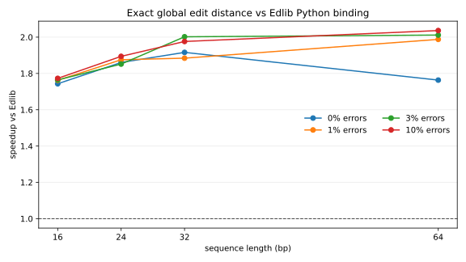
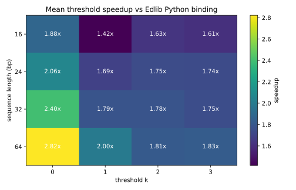
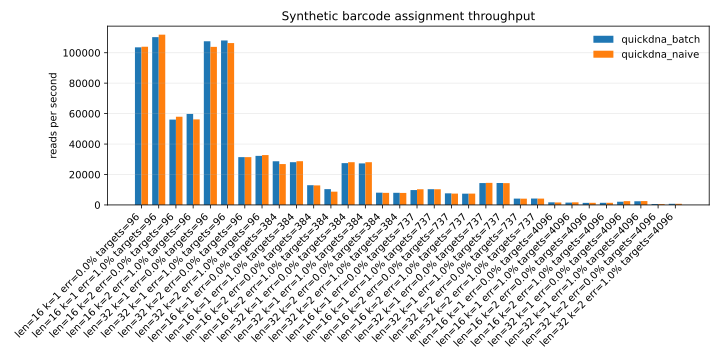

# Benchmark Report

- Platform: `macOS-26.2-arm64-arm-64bit`
- Python: `3.9.6`
- External exact edit-distance baseline: Edlib Python binding with `mode="NW"`, `task="distance"`.
- These graphs compare short global edit-distance workloads. They are not broad aligner benchmarks.

## Graphs

## Workflow Reports

- [Native Edlib assignment report](native/README.md)
- [Public CRISPR guide-counting report](public_crispr/README.md)
- [Barcode demultiplexing report](barcode_demux/README.md)
- [Raw BCL demultiplexing report](bcl_demux/README.md)

## Exact Distance Mean Speedup

| len | speedup_vs_edlib |
| --- | --- |
| 16 | 1.76 |
| 24 | 1.87 |
| 32 | 1.94 |
| 64 | 1.95 |

## Threshold Best Cases

| len | k | err | dotmatch_ns | edlib_ns | speedup_vs_edlib |
| --- | --- | --- | --- | --- | --- |
| 64 | 0 | 0.00 | 837.20 | 2732.30 | 3.26 |
| 64 | 0 | 0.03 | 832.00 | 2311.60 | 2.78 |
| 64 | 0 | 0.01 | 1223.10 | 3217.70 | 2.63 |
| 64 | 0 | 0.10 | 841.90 | 2201.00 | 2.61 |
| 32 | 0 | 0.00 | 810.70 | 2005.50 | 2.47 |
| 32 | 0 | 0.01 | 811.80 | 1996.40 | 2.46 |
| 32 | 0 | 0.03 | 836.10 | 1960.30 | 2.34 |
| 32 | 0 | 0.10 | 816.00 | 1880.60 | 2.30 |

## Batch Assignment Top Throughput Rows

| tool | len | k | n_targets | reads_per_sec |
| --- | --- | --- | --- | --- |
| dotmatch_naive | 32 | 0 | 96 | 4081633.1 |
| dotmatch_scan | 32 | 0 | 96 | 4081633.1 |
| dotmatch_scan | 16 | 0 | 96 | 3393730.4 |
| dotmatch_naive | 16 | 0 | 96 | 3262599.4 |
| dotmatch_scan | 24 | 0 | 96 | 2424331.6 |
| dotmatch_naive | 12 | 0 | 96 | 2370931.7 |
| dotmatch_scan | 12 | 0 | 96 | 2288800.1 |
| dotmatch_naive | 24 | 0 | 96 | 2277432.7 |
| dotmatch_scan | 8 | 0 | 96 | 2021026.9 |
| dotmatch_naive | 8 | 0 | 96 | 2020202.0 |
| dotmatch_scan | 32 | 0 | 384 | 1123595.5 |
| dotmatch_naive | 32 | 0 | 384 | 1117318.4 |

## Evidence Boundary

These results cover short-DNA global edit-distance and threshold matching against Edlib's Python binding.
Comparative performance wording should use native C Edlib, SeqAn, and Parasail comparisons where the scoring model is equivalent.
