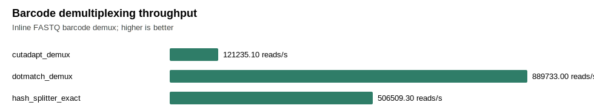
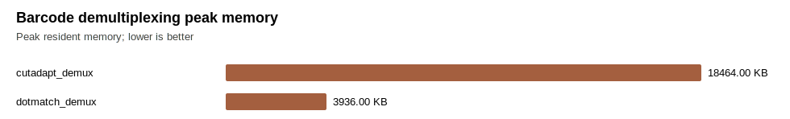
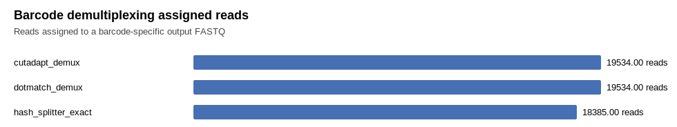

# Barcode Demultiplexing Benchmark

This report is the barcode-demultiplexing evidence track. It is separate from the CRISPR guide-counting report.

Current status: DotMatch now has a native `demux` command for fixed-position inline barcodes, including `--barcode-length auto` for barcode sheets with multiple lengths. Comparative barcode wording requires real public barcode datasets plus competitor rows, not only the built-in fixture.

The benchmark script can also emit a simple `hash_splitter_exact` row. This is a transparent exact-prefix baseline, not an edit-distance demultiplexer.

## Figures

## Raw Rows

| tool | workflow | semantics | repeats | reads | barcodes | k | metric | mean seconds | mean reads/sec | peak RSS KB | assigned | ambiguous | unmatched | verified/read | cv | exit |
| --- | --- | --- | ---: | ---: | ---: | ---: | --- | ---: | ---: | ---: | ---: | ---: | ---: | ---: | ---: | ---: |
| cutadapt_demux | synthetic_inline_barcode_fixture | anchored_cutadapt_demux_no_indels | 2 | 20000 | 4 | 1 | hamming | 0.165190 | 121235.1 | 18464 | 19534 |  | 466 |  | 0.0518 | 0 |
| dotmatch_demux | synthetic_inline_barcode_fixture | fixed_position_unique_ambiguous_nomatch | 2 | 20000 | 4 | 1 | hamming | 0.022480 | 889733.0 | 3936 | 19534 | 0 | 466 | 0.9767 | 0.0105 | 0 |
| hash_splitter_exact | synthetic_inline_barcode_fixture | longest_unique_exact_prefix_no_mismatch | 2 | 20000 | 4 | 0 | exact | 0.039518 | 506509.3 |  | 18385 |  | 1615 |  | 0.0403 | 0 |

## Comparison Evidence Gate

Do not describe DotMatch as barcode comparative until this table includes real public barcode workloads and fair competitor rows, at minimum Cutadapt plus a second comparator such as Ultraplex, Je, deML, sabre/fastx-style splitters, an exact hash splitter for the exact-prefix lane, and Illumina demux tools where their input model matches the benchmark.

Suggested real-data starting point: SRP009896 / SRR391079-SRR391082, a maize GBS dataset described in public Cutadapt demultiplexing examples as 5-prime inline barcode reads with 96 demultiplexed outputs. `scripts/fetch_srp009896_barcode_demo.py --use-public-example-barcodes` extracts the first-member barcode sheet from the public Google Drive example archive with a ranged request instead of downloading the full 7.4 GB ZIP, then filters rows to the requested accession when the run column is present.

Important boundary: the SRP009896 barcode sheet contains variable-length barcodes (`4-8 bp`) and reused barcode sequences across run blocks. SRP009896 reads include a leading `N`, so the public-example benchmark should use `--barcode-start 1`, `--barcode-length auto`, and the exact-prefix `k=0` lane unless a separate fixed-length sheet is supplied.
