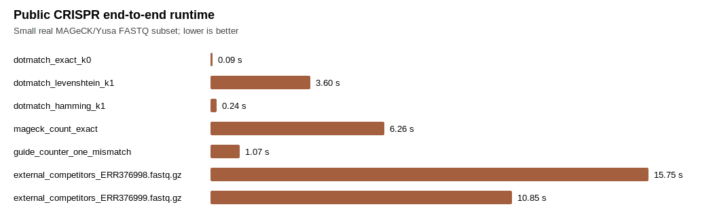
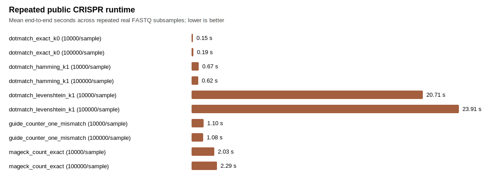
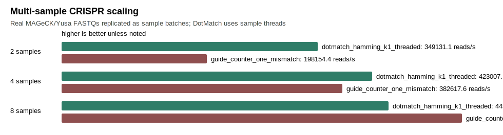
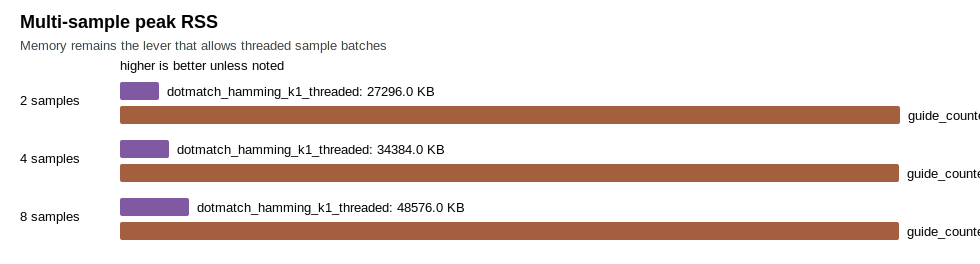

# Public CRISPR Workflow Comparator

This report tracks the real MAGeCK/Yusa public CRISPR benchmark. Smoke rows are useful for installation checks; repeated rows are the only rows intended to support user-facing performance statements.

## Smoke/Latest Table

| tool | version | semantics | n_reads | n_targets | seconds | reads_per_sec | peak_rss_kb | assigned_reads | corrected_reads | ambiguous_reads | rejected_reads | overcount_reads | verified_per_read | exit_code |
| --- | --- | --- | --- | --- | --- | --- | --- | --- | --- | --- | --- | --- | --- | --- |
| dotmatch_exact_k0 | local | exact_k0_no_errors | 20000 | 87437 | 0.087922 | 227474.7 | 27056 | 17894 | 0 | 0 | 2106 | 0 | 0.8947 | 0 |
| dotmatch_levenshtein_k1 | local | levenshtein_k1_substitution_insertion_deletion | 20000 | 87437 | 3.604998 | 5547.9 | 27344 | 19510 | 1616 | 38 | 452 | 0 | 2.8277 | 0 |
| dotmatch_hamming_k1 | local | hamming_k1_no_indels | 20000 | 87437 | 0.239661 | 83451.0 | 27232 | 18416 | 522 | 1 | 1583 | 0 | 202.0318 | 0 |
| mageck_count_exact | 0.5.9.5 | exact_fastq_count_trim5_23 | 20000 | 87437 | 6.263658 | 3193.0 | 131664 | 17894 | 0 |  | 2106 | 0 |  | 0 |
| guide_counter_one_mismatch | 0.1.3 | hamming_k1_no_indels_auto_offset | 20000 | 87437 | 1.072715 | 18644.3 | 541360 | 20956 |  |  | 0 | 956 |  | 0 |
| external_competitors_ERR376998.fastq.gz | see_competitor_csv | cutadapt_bowtie2_extracted_workflow | 10000 | 87437 | 15.749150 | 635.0 | 1113888 |  |  |  |  | 0 |  | 0 |
| external_competitors_ERR376999.fastq.gz | see_competitor_csv | cutadapt_bowtie2_extracted_workflow | 10000 | 87437 | 10.850010 | 921.7 | 1036944 |  |  |  |  | 0 |  | 0 |

## Repeated-Run Statistics

| tool | semantics | records_per_sample | repeats | mean_reads_per_sec | p50_reads_per_sec | p95_reads_per_sec | mean_seconds | p50_seconds | cv | max_peak_rss_mb | mean_verified_per_read |
| --- | --- | --- | --- | --- | --- | --- | --- | --- | --- | --- | --- |
| dotmatch_exact_k0 | exact_k0_no_errors | 10000 | 5 | 1308776.5 | 1355374.7 | 1417802.5 | 0.1545 | 0.1476 | 0.1086 | 28.6 | 0.894 |
| dotmatch_exact_k0 | exact_k0_no_errors | 100000 | 5 | 1143740.1 | 1087370.2 | 1483581.8 | 0.1914 | 0.1839 | 0.3043 | 28.7 | 0.894 |
| dotmatch_hamming_k1 | hamming_k1_no_indels | 10000 | 5 | 317832.9 | 345660.7 | 365711.3 | 0.6721 | 0.5786 | 0.2362 | 26.7 | 0.921 |
| dotmatch_hamming_k1 | hamming_k1_no_indels | 100000 | 5 | 331493.9 | 362405.3 | 368984.9 | 0.6199 | 0.5519 | 0.1662 | 28.7 | 0.921 |
| dotmatch_levenshtein_k1 | levenshtein_k1_substitution_insertion_deletion | 10000 | 5 | 9923.1 | 10513.8 | 11053.8 | 20.7058 | 19.0226 | 0.1623 | 28.9 | 2.822 |
| dotmatch_levenshtein_k1 | levenshtein_k1_substitution_insertion_deletion | 100000 | 5 | 8836.2 | 9205.9 | 11170.7 | 23.9098 | 21.7252 | 0.2446 | 27.5 | 2.822 |
| guide_counter_one_mismatch | hamming_k1_no_indels_auto_offset | 10000 | 5 | 189733.6 | 180274.6 | 234008.5 | 1.0973 | 1.1094 | 0.2233 | 528.7 |  |
| guide_counter_one_mismatch | hamming_k1_no_indels_auto_offset | 100000 | 5 | 194967.9 | 179267.6 | 255127.5 | 1.0752 | 1.1157 | 0.2457 | 528.7 |  |
| mageck_count_exact | exact_fastq_count_trim5_23 | 10000 | 5 | 104892.6 | 110238.2 | 129761.0 | 2.0349 | 1.8143 | 0.2415 | 155.2 |  |
| mageck_count_exact | exact_fastq_count_trim5_23 | 100000 | 5 | 92761.1 | 81964.5 | 123440.6 | 2.2909 | 2.4401 | 0.2804 | 158.9 |  |

## DotMatch Hamming Speedup

This table keeps the fair CRISPR speed lane separate: DotMatch Hamming `k=1` versus tools with one-mismatch/no-indel or exact-count semantics.

| baseline | records_per_sample | dotmatch_hamming_reads_per_sec | baseline_reads_per_sec | speedup |
| --- | --- | --- | --- | --- |
| guide_counter_one_mismatch | 10000 | 317832.9 | 189733.6 | 1.68x |
| guide_counter_one_mismatch | 100000 | 331493.9 | 194967.9 | 1.70x |
| mageck_count_exact | 10000 | 317832.9 | 104892.6 | 3.03x |
| mageck_count_exact | 100000 | 331493.9 | 92761.1 | 3.57x |

## Count Agreement

| comparison | status | n_guides | total_left | total_right | total_delta | differing_guides | max_abs_delta | pearson | spearman |
| --- | --- | --- | --- | --- | --- | --- | --- | --- | --- |
| dotmatch_hamming_vs_guide_counter | ok | 87437 | 184167 | 208700 | -24533 | 13537 | 26 | 0.94176266 | 0.95124146 |
| dotmatch_exact_vs_mageck_exact | ok | 87437 | 178715 | 178715 | 0 | 0 | 0 | 1.00000000 | 1.00000000 |

## Multi-Sample Scaling

| tool | n_samples | records_per_sample | total_reads | threads | seconds | reads_per_sec | peak_rss_kb | assigned_reads | overcount_reads | exit_code |
| --- | --- | --- | --- | --- | --- | --- | --- | --- | --- | --- |
| dotmatch_hamming_k1_threaded | 2 | 100000 | 200000 | 2 | 0.572851 | 349131.1 | 27296 | 184167 | 0 | 0 |
| guide_counter_one_mismatch | 2 | 100000 | 200000 | 1 | 1.009314 | 198154.4 | 541376 | 208700 | 8700 | 0 |
| dotmatch_hamming_k1_threaded | 4 | 100000 | 400000 | 4 | 0.945611 | 423007.1 | 34384 | 368334 | 0 | 0 |
| guide_counter_one_mismatch | 4 | 100000 | 400000 | 1 | 1.045430 | 382617.6 | 541312 | 417400 | 17400 | 0 |
| dotmatch_hamming_k1_threaded | 8 | 100000 | 800000 | 8 | 1.793937 | 445946.5 | 48576 | 736668 | 0 | 0 |
| guide_counter_one_mismatch | 8 | 100000 | 800000 | 1 | 1.466918 | 545361.1 | 541312 | 834800 | 34800 | 0 |

## Edlib Oracle Validation

| dataset | sample | oracle | checked_reads | mismatches | indel_window | stratum_exact | stratum_corrected | stratum_ambiguous | stratum_unmatched | stratum_contains_n |
| --- | --- | --- | --- | --- | --- | --- | --- | --- | --- | --- |
| mageck_yusa | plasmid | edlib_native | 1000 | 0 | 1 | 892 | 81 | 3 | 24 | 8 |
| mageck_yusa | ESC1 | edlib_native | 1000 | 0 | 1 | 895 | 77 | 3 | 25 | 5 |

## Interpretation

- `dotmatch_hamming_k1` is the fair lane for guide-counter-style one-mismatch/no-indel guide counting.
- `dotmatch_levenshtein_k1` is DotMatch's stronger lane: substitutions plus one-base insertions/deletions with explicit ambiguity reporting.
- `dotmatch_exact_k0` is the fair exact-count lane for MAGeCK's direct FASTQ counting mode.
- MAGeCK is run as exact FASTQ counting with `--trim-5 23`, matching the public Yusa demo workflow.
- guide-counter is fast, but on the 10k Yusa run its own stats report more mapped reads than input reads, consistent with its multi-offset counting loop; DotMatch assigns at most one target per read and reports ambiguity instead.
- In the multi-sample scaling table, DotMatch processes sample batches with threads while staying in the tens of MB. guide-counter uses roughly half a GB and its count total grows beyond input reads.
- Cutadapt and Bowtie2 rows are workflow comparators on extracted guide windows; they are not exact assignment oracles.
- Native Edlib scan remains the exact semantic oracle for assignment correctness.
- Public speed statements should cite only repeated rows with zero validation mismatches and explicit semantics.

## Raw Commands

| tool | command |
| --- | --- |
| dotmatch_exact_k0 | dotmatch count --targets examples/crispr_guides/data/yusa_library.csv --reads examples/crispr_guides/data/ERR376998.fastq.gz --reads examples/crispr_guides/data/ERR376999.fastq.gz --sample-label plasmid,ESC1 --target-start 23 --target-length 19 --k 0 --metric hamming --format mageck --out examples/crispr_guides/output/counts.exact.mageck.tsv --summary examples/crispr_guides/output/summary.exact.json |
| dotmatch_levenshtein_k1 | dotmatch count --targets examples/crispr_guides/data/yusa_library.csv --reads examples/crispr_guides/data/ERR376998.fastq.gz --reads examples/crispr_guides/data/ERR376999.fastq.gz --sample-label plasmid,ESC1 --target-start 23 --target-length 19 --k 1 --metric levenshtein --indel-window 1 --auto-offset 5 --auto-offset-sample 10000 --format mageck --out examples/crispr_guides/output/counts.levenshtein.mageck.tsv --summary examples/crispr_guides/output/summary.levenshtein.json |
| dotmatch_hamming_k1 | dotmatch count --targets examples/crispr_guides/data/yusa_library.csv --reads examples/crispr_guides/data/ERR376998.fastq.gz --reads examples/crispr_guides/data/ERR376999.fastq.gz --sample-label plasmid,ESC1 --target-start 23 --target-length 19 --k 1 --metric hamming --auto-offset 5 --auto-offset-sample 10000 --format mageck --out examples/crispr_guides/output/counts.hamming.mageck.tsv --summary examples/crispr_guides/output/summary.hamming.json |
| mageck_count_exact | build/competitor-env/bin/mageck count -l examples/crispr_guides/data/yusa_library.csv -n mageck_exact_benchmark --sample-label plasmid,ESC1 --trim-5 23 --fastq examples/crispr_guides/data/ERR376998.fastq.gz examples/crispr_guides/data/ERR376999.fastq.gz |
| guide_counter_one_mismatch | build/guide-counter/bin/guide-counter count --input examples/crispr_guides/data/ERR376998.fastq.gz examples/crispr_guides/data/ERR376999.fastq.gz --samples plasmid ESC1 --library examples/crispr_guides/data/yusa_library.csv --output examples/crispr_guides/output/guide_counter --offset-sample-size 10000 |
| external_competitors_ERR376998.fastq.gz | python3 scripts/bench_competitors.py --barcodes examples/crispr_guides/output/targets.tsv --reads examples/crispr_guides/data/ERR376998.fastq.gz --barcode-start 23 --barcode-length 19 --k 1 --dotmatch dotmatch --out examples/crispr_guides/output/competitors_ERR376998.fastq.csv --run-cutadapt --run-bowtie2 |
| external_competitors_ERR376999.fastq.gz | python3 scripts/bench_competitors.py --barcodes examples/crispr_guides/output/targets.tsv --reads examples/crispr_guides/data/ERR376999.fastq.gz --barcode-start 23 --barcode-length 19 --k 1 --dotmatch dotmatch --out examples/crispr_guides/output/competitors_ERR376999.fastq.csv --run-cutadapt --run-bowtie2 |
