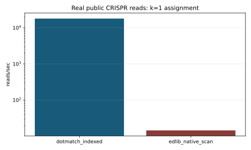

# Real CRISPR Benchmark

This report uses real public MAGeCK/Yusa CRISPR screen inputs, not synthetic reads.

- Guide library: `yusa_library.csv`
- FASTQ samples: `ERR376998.fastq.gz`, `ERR376999.fastq.gz`
- Extraction: `--target-start 23 --target-length 19`
- Assignment threshold: exact Levenshtein `k=1`
- Real reads benchmarked against Edlib scan: `25` extracted reads
- Real FASTQ records downloaded per sample: `25`
- Correctness comparator: native Edlib exhaustive scan over the guide library

## Native Real-Data Results

| tool | workflow | n_reads | n_targets | len | k | seconds | reads_per_sec | candidates_per_read | verified_per_read | checksum | mismatches |
| --- | --- | --- | --- | --- | --- | --- | --- | --- | --- | --- | --- |
| dotmatch_indexed | public_crispr_yusa | 25 | 87437 | 19 | 1 | 0.00 | 17972.70 | 0.84 | 0.84 | 14224824 | 0 |
| edlib_native_scan | public_crispr_yusa | 25 | 87437 | 19 | 1 | 1.72 | 14.50 | 87437.00 | 87437.00 | 14224824 | 0 |

## Speedup

DotMatch indexed speedup vs native Edlib scan on this real-data subset: `1239.50x`.

## Workflow Comparator Availability

| tool | status |
| --- | --- |
| mageck | not installed in this environment |
| cutadapt | not installed in this environment |
| bowtie2 | not installed in this environment |

MAGeCK, Cutadapt, and Bowtie2 are workflow comparators and are intentionally optional. Run `python3 scripts/run_public_crispr_benchmark.py --run-mageck --run-cutadapt --run-bowtie2` in an environment with those tools installed to populate those rows.

## Evidence Boundary

This benchmark supports known-target CRISPR guide assignment only under the listed extraction rules. Native Edlib remains the exact semantic oracle; MAGeCK/Cutadapt/Bowtie2 comparisons should be described as workflow comparisons, not identical semantic oracles.
